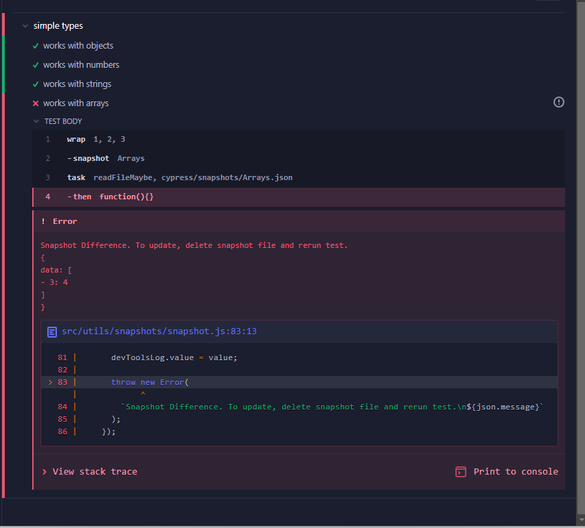

# @cypress/snapshot

> Adds value / object / DOM element snapshot testing support to Cypress test runner

[![NPM][npm-icon] ][npm-url]

[![Build status][ci-image] ][ci-url]
[![semantic-release][semantic-image] ][semantic-url]
[![renovate-app badge][renovate-badge]][renovate-app]

> **Note** \
> \
> Please take a look at a few other Cypress snapshot plugins:
>
> - [cypress-plugin-snapshots](https://github.com/meinaart/cypress-plugin-snapshots)
> - [cypress-image-snapshot](https://github.com/palmerhq/cypress-image-snapshot).

## Install

Requires [Node](https://nodejs.org/en/) version 10 or above.

```sh
npm install --save-dev @cypress/snapshot
```

## Import

After installing, add the following to your `cypress/support/commands.js` file

```js
require("@cypress/snapshot").register();
```
This registers a new command to create new snapshot or compare value to old snapshot

and add the following to your `cypress.config.js`

```js
  e2e: {
    setupNodeEvents(on, config) {
      require("@cypress/snapshot").tasks(on, config)
    },
```

**Note:** `@cypress/snapshot` **requires** the `readFileMaybe` plugin to be included, which can be easily done using the code above


# Usage

Currently, if you want to take more than one snapshot, you need to pass a Step Name to prevent overwrites / test failures

```js
describe("my tests", () => {
  it("works", () => {
    cy.log("first snapshot");
    cy.wrap({ foo: 42 }).snapshot("foo");
    cy.log("second snapshot");
    cy.wrap({ bar: 101 }).snapshot("bar");
  });
});
```

In the above case, you can find the stored snapshot in their own files, mentioned above them

```json
// cypress/snapshots/my-tests-works-foo.json
{"foo": 42}
// cypress/snapshots/my-tests-works-bar.json
{"bar": 101}
```

If you change the site values, the saved snapshot will no longer match, throwing an error

( picture taken from `cypress/snapshots/Arrays.json`)


Click on the `SNAPSHOT` step in the Command Log to see expected and current value printed in the DevTools.

### Options

You can control snapshot comparison and behavior through a few options.

```js
cy.get(...).snapshot({
  snapshotName: 'Snapshot Name', // to use as a File Name
  snapshotPath: 'cypress/not_snapshots', // where to save the Snapshot
  json: false                  // convert DOM elements into JSON 
})                            // when storing in the snapshot file

// will save as 
// cypress/not_snapshots/Snapshot-Name.json
```

You can also pass a "Step Name" to the Function

```js
cy.get(...).snapshot("Intercepted API Request")
// will save as 
// cypress/snapshots/<context>-<describe>-<it>-Intercepted-API-Request.json
// to prevent duplications
```

or both

```js
cy.get(...).snapshot("Intercepted API Request", {
  snapshotPath: "cypress/snapshots/api",
  snapshotName: "first_intercept" 
})

// will save as 
// cypress/snapshots/api/first_intercept.json
```

### Configuration

This module provides some configuration options:

#### snapshotPath
Sets the default Path for saving Snapshots (default: `cypress/snapshots`)

## Debugging

To debug this module run with environment variable `DEBUG=@cypress/snapshot`

# 

### Small print

Author: Gleb Bahmutov &lt;gleb@cypress.io&gt; &amp;  Joshua D. &lt;[cypress@lio.cat](mailto:cypress@lio.cat)&gt; &copy; Cypress.io 2017-2022
<br>
License: MIT - do anything with the code, but don't blame us if it does not work.

Support: If you find any problems with this module, email / tweet /
[open issue](https://github.com/cypress-io/snapshot/issues) on Github

## MIT License

Copyright (c) 2017-2022 Cypress.io &lt;hello@cypress.io&gt;

Permission is hereby granted, free of charge, to any person
obtaining a copy of this software and associated documentation
files (the "Software"), to deal in the Software without
restriction, including without limitation the rights to use,
copy, modify, merge, publish, distribute, sublicense, and/or sell
copies of the Software, and to permit persons to whom the
Software is furnished to do so, subject to the following
conditions:

The above copyright notice and this permission notice shall be
included in all copies or substantial portions of the Software.

THE SOFTWARE IS PROVIDED "AS IS", WITHOUT WARRANTY OF ANY KIND,
EXPRESS OR IMPLIED, INCLUDING BUT NOT LIMITED TO THE WARRANTIES
OF MERCHANTABILITY, FITNESS FOR A PARTICULAR PURPOSE AND
NONINFRINGEMENT. IN NO EVENT SHALL THE AUTHORS OR COPYRIGHT
HOLDERS BE LIABLE FOR ANY CLAIM, DAMAGES OR OTHER LIABILITY,
WHETHER IN AN ACTION OF CONTRACT, TORT OR OTHERWISE, ARISING
FROM, OUT OF OR IN CONNECTION WITH THE SOFTWARE OR THE USE OR
OTHER DEALINGS IN THE SOFTWARE.

[npm-icon]: https://nodei.co/npm/@cypress/snapshot.svg?downloads=true
[npm-url]: https://npmjs.org/package/@cypress/snapshot
[ci-image]: https://travis-ci.org/cypress-io/snapshot.svg?branch=master
[ci-url]: https://travis-ci.org/cypress-io/snapshot
[semantic-image]: https://img.shields.io/badge/%20%20%F0%9F%93%A6%F0%9F%9A%80-semantic--release-e10079.svg
[semantic-url]: https://github.com/semantic-release/semantic-release
[renovate-badge]: https://img.shields.io/badge/renovate-app-blue.svg
[renovate-app]: https://renovateapp.com/
