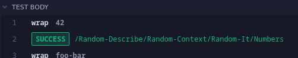

# @datashard/snapshot

> Adds JSON Snapshot comparison to Cypress

## ⚠️ Breaking Changes ⚠️

- With V3, the `readFileMaybe` task has been removed, we now rely on `cy.fixture` internally. 
- the previous `SNAPSHOT_UPDATE` Environment/Config Variable has been changed to `updateSnapshots`

> [!DANGER] 
This means that previous tests will likely be broken, *please make sure that your tests pass before updating to the latest version of this Plugin*.

This current release will be released as `3.0.0-beta`, should Bugs be found by me or my Employer, I will open Issues/PRs to fix those, should anyone else find Bugs/Edgecases, etc. please open an Issue.

## Install

Requires Node 16 or above

```sh
npm i --save-dev @datashard/snapshot
```

## Import

After Installing, you'll need to add the following import into your Commands/Support File

> by default this will be `cypress/support/e2e.js`

```js
require('@datashard/snapshot').regsiter()
```

This will register a new Command `.snapshot()`, to create and compare JSON Snapshots.

## Config

You can pass `updateSnapshots` and `useFolders` as options in the `cypress.config.js` file


Alternatively, you can also add `snapshotUpdate` as an Environment Variable to update your snapshots.

Simply pass `--env updateSnapshots=true` when running Cypress.

## Usage

If properly added, usage of this plugin is rather simple, just add `.snapshot()` to cypress functions that return valid JSON. (i.e. `cy.wrap`)

When properly added, you can chain `.snapshot()` off of `cy` functions like `cy.wrap`, just make sure they return valid JSON.

### Example

```js
describe("my test", () => {
  it("works", () => {
    cy.log("first snapshot");
    cy.wrap({ foo: 42 }).snapshot("foo");
    cy.log("second snapshot");
    cy.wrap({ bar: 101 }).snapshot("bar");
  });
});
```

This Plugin will then save your snapshots as

```ts
// useFolders: false
cypress/fixtures/my-test__works__foo.json
cypress/fixtures/my-test__works__bar.json

// useFolders: true
cypress/fixtures/my-test/works/foo.json
cypress/fixtures/my-test/works/bar.json

// {fixtureFolder}/<Context>-<Describe>-<It>-<Name?>.json
// {fixtureFolder}/<Context>/<Describe>/<It>/<Name?>.json

```

Snapshots will generally be saved using this the Convention mentioned in the Comment of the above Codeblock, which is provided by the named Cypress Test Steps.

Passing a name to the Snapshot function is required, but not checked, if you want to take multiple snapshots in the same block. 

If you have two or more Snapshots in the same Block, the next one ***WILL*** always overwrite the previous one while updating, causing the First Snapshot in the Block to Fail.
While running your Tests, if a value changed, it will, of course, no longer match the snapshot and throw an Error.

Which will look like this:


When the Test succeeds, it will instead log a Success in the Log and let you know where the File has been saved to, relative to the Fixture Snapshot Folder


